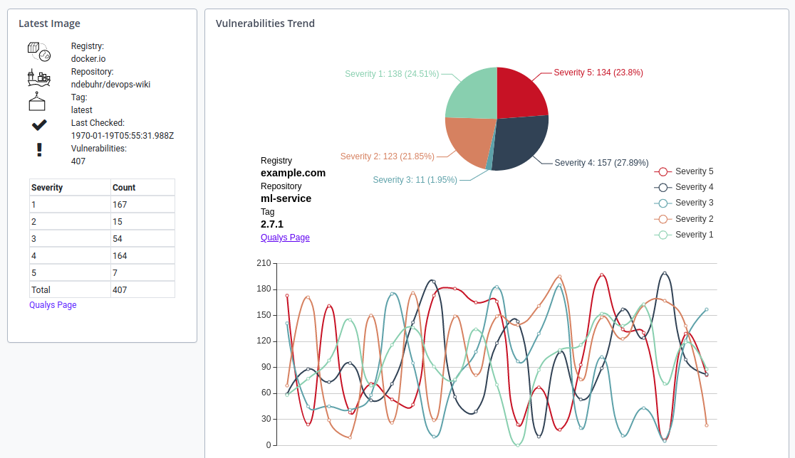

# Qualys Integration for XL Release

[](https://travis-ci.org/xebialabs-community/xlr-qualys-plugin)

[![License: MIT][xlr-qualys-plugin-license-image]][xlr-qualys-plugin-license-url]
[![Github All Releases][xlr-qualys-plugin-downloads-image]][xlr-qualys-plugin-releases-url]
[](https://github.com/RichardLitt/standard-readme)

> The Qualys plugin is a modular approach for introducing vulnerability gating and visualization in XL Release

## Installation

### Requirements

1. XL Release 9.0+

### Building the plugin
The gradle wrapper facilitates building the plugin.  Use the following command to build using [Gradle](https://gradle.org/):
```bash
./gradlew clean build
```
The built plugin, along with other files from the build, can then be found in the _build_ folder.  This plugin leverages [nebula.release](https://github.com/nebula-plugins/nebula-release-plugin).  The default values for `release.scope` and `release.useLastTag` are `'patch'` and `true`, respectively.

### Adding the plugin to XL Release

Download the latest version of the plugin from the [releases page][xlr-qualys-plugin-releases-url].  The plugin can then be installed through the XL Release graphical interface or the server backend.  For additional detail, please refer to [the docs.xebialabs.com documentation on XLR plugin installation](https://docs.xebialabs.com/xl-release/how-to/install-or-remove-xl-release-plugins.html)

### Configuration

The Qualys server can be configured at a global level, in _Shared Configuration_, or on a finer lever (e.g. at the folder level).  Please refer to [the docs.xebialabs.com documentation on configurations](https://docs.xebialabs.com/xl-release/how-to/create-custom-configuration-types.html#configuration-page).  Qualys uses Basic Authentication for all API requests, so the standard authentication selection dropdown is not provided on the XL Release server configuration page.

## Usage

### Tasks

#### Check Compliance

The intended use case here is automated vulnerability gating.  Total vulnerability count and/or maximum vulnerability severity can be used for gating.  The plugin terminology around vulnerabilities, including the severity level meanings, is simply a reflection of the terminology used by Qualys.

### Dashboard Tiles



#### Vulnerabilities Summary

The vulnerabilities summary tile provides a snapshot of vulnerabilities for a single Docker image.  If you use a "latest" tag, this tile will present the latest vulnerability information.

#### Vulnerabilities Trend

The vulnerabilities trend tile shows vulnerabilities over time.  The standard Qualys image filtering and sorting syntax can be used directly in the tile configuration for flexible trends analysis.  Interactivity components include:
1. Hover over points in the plot to see image metadata, a Qualys hyperlink, and a pie chart of vulnerability severities
1. Hover over the pie chart to see the vulnerability severity breakdown emphasized
1. Click lines in the "Severity" legend to show and hide the trends for certain severities (e.g. hide the low Severity 1 and Severity 2 lines)

## Contributing

Please review the contributing guidelines for _xebialabs-community_ at [http://xebialabs-community.github.io/](http://xebialabs-community.github.io/)

## License

This community plugin is licensed under the [MIT license][xlr-qualys-plugin-license-url].

See license in [LICENSE.md](LICENSE.md)

[xlr-qualys-plugin-license-image]: https://img.shields.io/badge/license-MIT-yellow.svg
[xlr-qualys-plugin-license-url]: https://opensource.org/licenses/MIT
[xlr-qualys-plugin-downloads-image]: https://img.shields.io/github/downloads/xebialabs-community/xlr-qualys-plugin/total.svg
[xlr-qualys-plugin-releases-url]: https://github.com/xebialabs-community/xlr-qualys-plugin/releases
